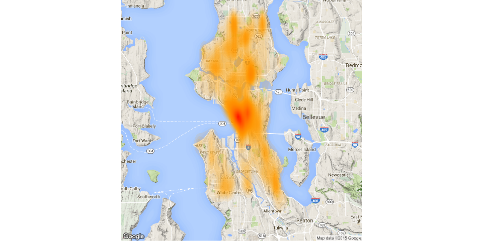
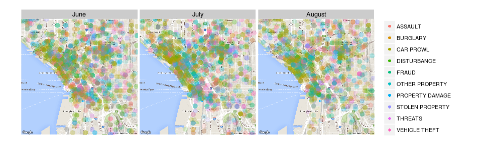

# Crime Highest in Central Seattle during Summer 2014
Jeremy Shantz  
2015-11-26  

Seattle's crime was highest in the city centre during the summer of 2014. Using 32,000+ crime reports collected from June to July as part of the [Seattle Summer 2014 dataset](https://github.com/uwescience/datasci_course_materials/blob/master/assignment6/seattle_incidents_summer_2014.csv?raw=true), we constructed a heatmap overlaid on top of a map of Seattle. A significant "hot spot" can clearly be seen in the centre of the city. In the North end, we observe a cluster of smaller hot spots. The heatmap's use of position and hue communicates both the distribution of the data and its frequency or intensity.

 

## Summarized Offense Description

Next we examine the pattern of common crimes in the city centre. Focusing on the Summarized Offense Description field, we restrict our dataset to only the top 10 summarized offenses. Crime reports are plotted on a map of the city centre, coloured by offense. We further facet the plot by month. This figure allows us to see the distribution of common crimes in the core, and the pattern of that distribution across time. These plots use color to highlight a categorical variable and temporal facetting the plots illustrates change.

 

## Reproducibility

This report was produced using an R Markdown script, a feature of the R programming language that allows for a "literate" programming style which mixes text with executable code. The full source code is available [here](https://github.com/jeremyshantz/seattle-crime-analytics/raw/master/crime.Rmd) and the data set is available [here](https://github.com/uwescience/datasci_course_materials/blob/master/assignment6/seattle_incidents_summer_2014.csv?raw=true).
